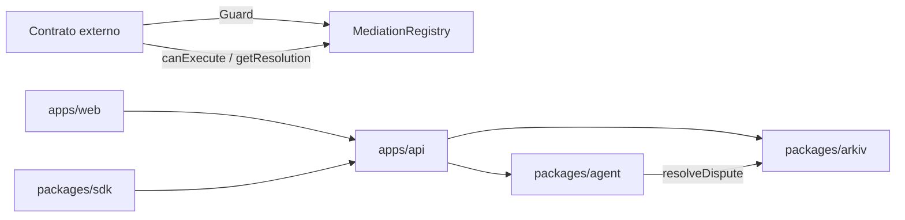

# Arquitectura

## Visión general

Mediation Rooms separa la **lógica de mediación** del **contrato externo**. El contrato solo necesita saber si puede ejecutar una acción crítica o qué resolución emitió el sistema.

## Capas

### On-chain (`packages/contracts`)

- **IMediationRegistry** — interfaz del registro
- **MediationRegistry** — casos, partes, status, resolución, timestamps
- **MediationGuard** — abstract contract para heredar en contratos externos
- **DemoEscrow** — demo de escrow con ventana de mediación

### Off-chain

| Paquete | Responsabilidad |
|---------|-----------------|
| `apps/api` | Orquestación de casos, evidencia, disputas y resoluciones |
| `apps/web` | UI para partes y demo |
| `packages/arkiv` | Memoria temporal del caso (evidencia, claims, análisis) |
| `packages/agent` | Resolución de disputas (mock → OpenAI) |
| `packages/sdk` | Cliente TS para integradores |
| `packages/config` | Tipos y constantes compartidas |
| `packages/ui` | Componentes React reutilizables |

## Arkiv

Todas las entidades incluyen el atributo `PROJECT_ATTRIBUTE = "mediation-rooms"` para filtrar por proyecto.

Entidades:
- `case`
- `evidence`
- `claim`
- `agent_analysis`

## Flujo de datos

1. Contrato abre caso via `MediationRegistry.openCase`
2. Partes interactúan en web → API persiste en Arkiv
3. Si hay disputa → `markDisputed` on-chain + off-chain
4. Agente analiza evidencia → `resolveDispute`
5. Registry actualiza resolución → contrato consulta `canExecute`

## Decisiones de diseño (hackathon)

- Store in-memory en API y Arkiv (reemplazar por DB + Arkiv real)
- Agente mock con heurísticas simples
- Sin auth todavía — agregar antes de producción
- Webhook placeholder para sync on-chain ↔ off-chain
