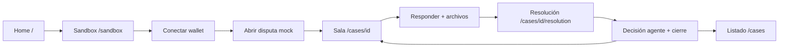

# Flujo actual de la web — Mediation Rooms

> Documento para refactor visual/UX. Describe **cómo funciona hoy**, **qué ve el usuario en cada pantalla** y **qué rutas quedaron fuera del flujo principal**.
>
> **Última actualización:** Mayo 2026 · **Stack:** Next.js (`apps/web`) + API Hono + Arkiv Braga

---

## Tabla de contenidos

1. [Rol del producto](#1-rol-del-producto-contexto-ux)
2. [Shell global](#2-shell-global-siempre-visible)
3. [Mapa de rutas](#3-mapa-de-rutas)
4. [Flujo principal (happy path)](#4-flujo-principal-happy-path-del-demo)
5. [Pantalla por pantalla](#5-pantalla-por-pantalla)
6. [Estados del caso](#6-estados-del-caso-y-qué-ve-el-usuario)
7. [Acciones que requieren wallet](#7-acciones-que-requieren-wallet)
8. [Datos disponibles pero no destacados](#8-datos-que-existen-pero-la-ui-no-destaca)
9. [Inconsistencias / deuda UX](#9-inconsistencias--deuda-ux-actual-para-el-refactor)
10. [Propuesta de flujo visual ideal](#10-propuesta-de-flujo-visual-ideal-referencia-para-refactor)
11. [Resumen](#11-resumen-en-una-frase)
12. [Anexo: archivos de código](#12-anexo-archivos-de-código-relevantes)

---

## 1. Rol del producto (contexto UX)

La web **no crea disputas** en producción. Es una **sala de mediación**: el usuario entra cuando un contrato externo (o el sandbox de demo) ya abrió una disputa.

| Concepto | Detalle |
|---|---|
| **Persona principal del demo** | **Respondent** (freelancer reclamado). El copy asume: *"Sos la parte reclamada"*. |
| **Wallet** | MetaMask u otra EIP-1193, red **Arkiv Braga**. |
| **Sin wallet** | Podés navegar; para responder tenés que firmar on-chain. |
| **Origen de disputas** | Contrato externo vía `POST /integrations/disputes`, o sandbox mock vía `POST /mock/contracts/:id/open-dispute`. |

---

## 2. Shell global (siempre visible)

**Rutas:** todas las páginas  
**Archivos:** `apps/web/src/app/layout.tsx`, `apps/web/src/components/wallet-provider.tsx`

| Elemento | Qué muestra / hace |
|---|---|
| **Nav** | Links: **Mediation Rooms** (home), **Disputas**, **Sandbox** |
| **WalletBar** | Sin conectar: botón *"Conectar wallet (Braga)"*. Conectada: dirección truncada (`0xAa77…d7bE`) + *"Desconectar"* |
| **Contenedor** | Ancho máx. 960px, padding 2rem, fondo blanco |

**Nota UX:** no hay indicador de red Braga más allá del texto del botón. No hay breadcrumb ni stepper del flujo.

---

## 3. Mapa de rutas

| Ruta | En nav | Flujo principal | Propósito |
|---|---|---|---|
| `/` | Sí | Entrada | Landing explicativa |
| `/cases` | Sí | Sí | Listado de disputas |
| `/cases/[id]` | No | **Sí (core)** | Sala de mediación |
| `/cases/[id]/resolution` | No | **Sí (core)** | Decisión del agente |
| `/sandbox` | Sí | Sí (demo) | Simular disputa desde mock |
| `/cases/[id]/evidence` | No | **No** | Evidencia extra (huérfana) |
| `/demo/escrow` | No | **No** | Demo Anvil/local (legacy) |

---

## 4. Flujo principal (happy path del demo)



### Pasos concretos

1. Usuario va a **Sandbox** (o Home → link sandbox).
2. Conecta wallet en la barra superior.
3. Elige contrato mock, edita reclamo, confirma que su wallet es **respondent**.
4. Clic **"Abrir disputa y entrar a la sala"** → redirige a `/cases/{caseId}`.
5. Lee reclamo, reglas, evidencia del claimant.
6. Escribe descargo, sube archivos opcionales, envía (firmas MetaMask en Braga).
7. Redirige automático a `/cases/{caseId}/resolution`.
8. El agente resuelve solo (spinner → resultado).
9. Puede volver al caso cerrado o al listado de disputas.

---

## 5. Pantalla por pantalla

### 5.1 Home — `/`

**Archivo:** `apps/web/src/app/page.tsx`

| Campo | Valor |
|---|---|
| **Título** | Mediation Rooms |
| **Subtítulo** | Infraestructura plug-and-play para mediación en contratos digitales |

**Bloques:**

| Card | Contenido |
|---|---|
| **¿Qué es?** | Texto: contrato externo abre disputa con reglas + evidencia; respondent contesta firmando; agente IA decide; todo en Arkiv Braga |
| **Empezar** | Links: Ver disputas, Sandbox, recordatorio de conectar wallet |

**Acciones:** solo navegación. Sin CTA principal destacado.  
**Estilo:** `PlaceholderCard` (borde punteado).

---

### 5.2 Listado de disputas — `/cases`

**Archivo:** `apps/web/src/app/cases/page.tsx`

| Campo | Valor |
|---|---|
| **Título** | Disputas |
| **Subtítulo** | Solo lectura + mediación; las disputas no se crean acá |

**Bloque informativo:** Cómo aparecen las disputas (`POST /integrations/disputes`) + link al sandbox.

**Estado vacío:** *"No hay disputas todavía. Simulá una desde el sandbox."*

**Cada fila (si hay casos):**

| Campo | Visual |
|---|---|
| `caseId` | Texto bold, link a detalle |
| Origen | `contractType · contractId` (gris, si existe) |
| Estado | `StatusBadge`: OPEN, DISPUTED, RESOLVED, etc. |

**No muestra:** reclamo, partes, deadline, resolución, preview de reglas.

---

### 5.3 Sandbox — `/sandbox`

**Archivos:** `apps/web/src/app/sandbox/page.tsx`, `apps/web/src/components/sandbox-contracts.tsx`

| Campo | Valor |
|---|---|
| **Título** | Sandbox de contratos |
| **Subtítulo** | Mocks que simulan contratos reales integrados |

**Bloque informativo:** Reglas, partes, evidencia inicial, TTL 48h, firma del respondent, agente IA.

**Por cada contrato mock (`ContractCard`):**

| Sección | Contenido |
|---|---|
| Header | Título + descripción del contrato |
| Reglas | Lista numerada (solo lectura) |
| Respondent | Input de address (monospace). Se autocompleta con wallet conectada. Hint según wallet conectada o no |
| Reclamo | Textarea editable (default: `sampleClaim` del mock) |
| CTA | **"Abrir disputa y entrar a la sala"** |
| Errores | Mensaje rojo si falla la API |

**Acción backend:** `POST /mock/contracts/:id/open-dispute` → redirect a `/cases/{caseId}`.

**No muestra:** evidencia inicial del mock en UI (sí se envía al backend). No muestra address del claimant (queda fija del mock).

---

### 5.4 Sala de mediación — `/cases/[caseId]` ⭐ pantalla central

**Archivo:** `apps/web/src/app/cases/[caseId]/page.tsx`  
**Formulario:** `apps/web/src/components/respond-form.tsx`

| Campo | Valor |
|---|---|
| **Título** | Sala de mediación |
| **Subtítulo** | Origen del contrato + *"Sos la parte reclamada (respondent)"* |
| **Badge** | Estado del caso (ej. DISPUTED) |

#### Card 1 — El reclamo en tu contra (accent: warning)

| Dato | Fuente |
|---|---|
| Texto del reclamo | `caseRecord.claim` |
| Reclama (claimant) | label + address truncada |
| Vos (respondent) | label + address truncada |
| Deadline | `expiresAt` formateado (*"Tenés hasta…"*) |

#### Card 2 — Reglas del contrato

- Subtítulo: *"El agente de IA decide en base a estas reglas"*
- Lista numerada de `caseRecord.rules`
- Vacío: *"Sin reglas declaradas"*

#### Card 3 — Evidencia del reclamante

- Items del audit trail (`EVIDENCE_SUBMITTED`, role `CLAIMANT`)
- Por item: descripción + link *"Ver tx"* (explorer Braga)
- Vacío: *"No adjuntó evidencia inicial"*

#### Card 4 — Tu respuesta **o** Caso resuelto

**Si `status === DISPUTED`:**

| Campo | Comportamiento |
|---|---|
| Textarea *"Tu descargo"* | Obligatorio |
| Input file (múltiple) | Opcional; lista nombre + KB |
| Hint | Cada archivo = 1 firma + 1 firma por respuesta |
| Botón | **"Enviar respuesta y pasar a resolución"** |
| Estados loading | *"Conectando wallet…"*, *"Firmando evidencia X/Y…"*, *"Firmando tu respuesta…"*, *"Redirigiendo…"* |
| Errores | Wallet incorrecta, no conectada, etc. |

**Si `status === RESOLVED`:**

- Texto: resolución final (`caseRecord.resolution`)
- Botón: *"Ver decisión del agente →"* → `/resolution`

#### Card 5 — Trazabilidad on-chain (Arkiv Braga)

- Timeline cronológico de **todos** los eventos del audit
- Por evento: `summary` + link *"tx"*
- Vacío: *"Sin eventos todavía"*

**No muestra en esta pantalla:**

- Respuesta del respondent ya enviada (texto)
- Evidencia del respondent (solo en audit si ya se subió)
- Link a `/evidence` (ruta existe pero no está enlazada)
- Stepper de progreso (reclamo → respuesta → resolución)

---

### 5.5 Resolución — `/cases/[caseId]/resolution`

**Archivos:** `apps/web/src/app/cases/[caseId]/resolution/page.tsx`, `apps/web/src/components/resolution-flow.tsx`

| Campo | Valor |
|---|---|
| **Título** | Resolución del caso |
| **Subtítulo** | El agente evalúa reclamo, respuesta y reglas |

**Comportamiento automático:** si el caso está `DISPUTED`, al montar la página llama `POST /cases/:id/resolve` (sin botón manual).

#### Fase A — Analizando

| Elemento | Contenido |
|---|---|
| Card | *"El agente está evaluando el caso"* |
| Texto | *"Analizando el reclamo, tu respuesta y las reglas…"* |
| UI | Spinner CSS |

#### Fase B — Error

- Mensaje de error + botón **Reintentar**

#### Fase C — Decisión (Card *"Decisión del agente"*)

| Campo | Contenido |
|---|---|
| Headline | Label humano según outcome (ej. *"Favorable al PROVEEDOR — se libera el pago"*) |
| Badge | RESOLVED |
| Outcome | Código técnico (`RELEASE_TO_PROVIDER`, etc.) |
| Confianza | Porcentaje |
| Razonamiento | Texto del agente |
| Acción recomendada | Texto |
| Evaluación por regla | Lista: regla, favorece Cliente/Proveedor/Neutral, rationale |
| On-chain | Link *"Ver transacción"* si hay `txUrl` de la decisión |
| CTAs | *"Ver caso cerrado"* → sala; *"Volver a disputas"* → listado |

**Outcomes y labels humanos:**

| Outcome | Label en UI |
|---|---|
| `REFUND_TO_CLIENT` | Favorable al CLIENTE (claimant) — reembolso |
| `RELEASE_TO_PROVIDER` | Favorable al PROVEEDOR (respondent) — se libera el pago |
| `SPLIT_PAYMENT` | Resolución parcial — se reparte el pago |
| `REQUEST_MORE_EVIDENCE` | Falta evidencia — sin decisión |
| `MANUAL_REVIEW` | Escalado a revisión manual |

**Si el caso ya estaba `RESOLVED`:** carga análisis desde audit (`AGENT_DECISION`) sin volver a resolver.

**No muestra:** resumen del reclamo/respuesta, countdown, qué hacer después en el contrato externo.

---

### 5.6 Evidencia — `/cases/[id]/evidence` ⚠️ fuera del flujo

**Archivo:** `apps/web/src/app/cases/[caseId]/evidence/page.tsx`

**No está enlazada** desde la sala ni el nav.

| Campo | Valor |
|---|---|
| **Título** | Evidencia |
| **Subtítulo** | Caso `{caseId}` |

| Bloque | Contenido |
|---|---|
| Subir evidencia | Form genérico: rol (claimant/respondent), descripción, contentHash, URI. Firma en Braga |
| Evidencia on-chain | Lista de todos los eventos `EVIDENCE_SUBMITTED` |
| Footer | Link *"← Volver al caso"* |

**Duplicación UX:** el respondent ya sube archivos en la sala (`RespondForm`). Esta página es redundante para el flujo demo.

---

### 5.7 Demo Escrow — `/demo/escrow` ⚠️ legacy

**Archivo:** `apps/web/src/app/demo/escrow/page.tsx`

**No está en el nav.** Pensada para Anvil + contratos Solidity locales.

- Aviso: no configurada sin `.env` de addresses
- Panel técnico: deposit, markDelivery, openDispute, release, refund, resolveCase
- JSON snapshot on-chain

**No usar para el refactor del producto Braga/Arkiv.**

---

## 6. Estados del caso y qué ve el usuario

| Estado | Listado | Sala | Formulario responder | Resolución |
|---|---|---|---|---|
| `DISPUTED` | Badge warning | Formulario activo | Sí | Auto-resuelve al entrar |
| `RESOLVED` | Badge success | Card *"Caso resuelto"* + link | No (mensaje estado) | Muestra decisión |
| `OPEN` | Badge default | Formulario bloqueado* | No | N/A en flujo mock |
| `EXPIRED_NO_DISPUTE` | Badge default | — | No | — |
| `CANCELLED` | Badge danger | — | No | — |

\* En el sandbox las disputas nacen directo en `DISPUTED`.

---

## 7. Acciones que requieren wallet

| Acción | Pantalla | Firmas MetaMask |
|---|---|---|
| Conectar wallet | Nav | Switch a Braga + connect |
| Responder | Sala | 1 por archivo + 1 por respuesta |
| Subir evidencia suelta | `/evidence` | 1 por evidencia |
| Ver / listar | Todas | No |

**Flujo de firma al responder:**

1. Por cada archivo: `writeEvidenceToArkiv` → `POST /cases/:id/evidence`
2. Respuesta: `writeResponseToArkiv` → `POST /cases/:id/respond`
3. Redirect a `/cases/:id/resolution`

---

## 8. Datos que existen pero la UI no destaca

Información disponible en API/audit que hoy está enterrada o ausente.

| Dato | Dónde está hoy | Oportunidad UX |
|---|---|---|
| Respuesta del respondent | Backend + audit (`DISPUTE_RESPONSE`) | Mostrar en sala post-respuesta |
| Evidencia del respondent | Audit | Card dedicada en sala/resolución |
| Origen del contrato | Subtítulo + listado | Hero/metadata del caso |
| `expiresAt` | Solo en card reclamo | Countdown / urgencia visual |
| Outcome legible | Solo en resolución | También en listado y sala cerrada |
| Confianza del agente | Solo resolución | Badge resumen en caso cerrado |
| Links explorer | Inline en listas | Iconos consistentes, sección *"Pruebas on-chain"* |
| Partes completas | Addresses truncadas | Avatars, roles claros, copy-to-clipboard |
| `ruleEvaluations` | Solo resolución | Resumen en caso cerrado |

---

## 9. Inconsistencias / deuda UX actual (para el refactor)

1. **Dos sistemas de cards:** `PlaceholderCard` (punteado) en home/listado/sandbox/evidence vs `Card` sólida en sala/resolución.
2. **Flujo no guiado:** no hay stepper (Sandbox → Reclamo → Respuesta → Decisión → Cierre).
3. **Ruta huérfana `/evidence`:** confunde; la evidencia del respondent ya va en el formulario principal.
4. **`/demo/escrow`:** legacy Anvil; conviene ocultar o eliminar del repo público.
5. **`AuditTrailPanel`:** componente existe (`audit-trail-panel.tsx`) pero la sala usa HTML inline duplicado.
6. **Listado muy escueto:** solo ID + badge; poco útil para escanear casos.
7. **Copy técnico expuesto:** `POST /integrations/disputes`, códigos `REFUND_TO_CLIENT` mezclados con texto humano.
8. **Rol fijo "respondent":** no hay vista claimant ni selector de rol (ok para demo, limitante si querés mostrar ambas partes).
9. **Home pasiva:** no empuja a un CTA claro (*"Probar demo"* → sandbox).
10. **Post-resolución:** no explica qué significa el outcome para el contrato externo (reembolso vs liberar pago).

---

## 10. Propuesta de flujo visual ideal (referencia para refactor)

Sin implementar — guía de diseño alineada con lo que ya hace el backend:

```
[Paso 1] Sandbox / Demo     →  Crear disputa (wallet = respondent)
[Paso 2] Sala               →  Contexto: reclamo + reglas + pruebas en contra
[Paso 3] Responder          →  Descargo + archivos (misma pantalla o modal)
[Paso 4] Resolución         →  Espera agente → veredicto + reglas evaluadas
[Paso 5] Cierre             →  Caso RESOLVED + audit trail + outcome destacado
```

### Pantallas a consolidar

- Fusionar evidencia del respondent en la **sala** (eliminar o esconder `/evidence`).
- En **resolución**, arriba un resumen compacto del caso (reclamo vs respuesta).
- En **listado**, cards con: origen, estado, deadline, outcome si cerrado.
- **Home** con un solo CTA: *"Iniciar demo"* → `/sandbox`.

### Jerarquía visual sugerida por pantalla

#### Home
- Hero + CTA primario → Sandbox
- 3 bullets: qué es / cómo funciona / trazabilidad Arkiv
- Link secundario → Disputas

#### Sandbox
- Step indicator: *"Paso 1 de 4 — Crear disputa"*
- Card contrato con reglas colapsables
- Wallet status prominente
- CTA grande

#### Sala
- Step indicator: *"Paso 2–3 — Revisar y responder"*
- Layout 2 columnas (desktop): contexto izq / formulario der
- Countdown deadline
- Audit trail colapsable al final

#### Resolución
- Step indicator: *"Paso 4 — Decisión"*
- Estado loading con mensaje claro
- Veredicto grande + confianza + reglas evaluadas
- CTAs post-cierre

#### Listado
- Cards ricas, no filas planas
- Filtro por estado (opcional)

---

## 11. Resumen en una frase

Hoy la web es un **visor + sala de mediación centrada en el respondent**: el demo arranca en **Sandbox**, entra a **Sala** para leer el reclamo y responder firmando en Braga, pasa solo a **Resolución** donde el agente decide automáticamente, y el **listado** sirve para volver a casos abiertos o cerrados.

---

## 12. Anexo: archivos de código relevantes

| Área | Archivo |
|---|---|
| Layout + nav | `apps/web/src/app/layout.tsx` |
| Home | `apps/web/src/app/page.tsx` |
| Listado | `apps/web/src/app/cases/page.tsx` |
| Sandbox page | `apps/web/src/app/sandbox/page.tsx` |
| Sandbox UI | `apps/web/src/components/sandbox-contracts.tsx` |
| Sala | `apps/web/src/app/cases/[caseId]/page.tsx` |
| Form responder | `apps/web/src/components/respond-form.tsx` |
| Resolución page | `apps/web/src/app/cases/[caseId]/resolution/page.tsx` |
| Resolución UI | `apps/web/src/components/resolution-flow.tsx` |
| Evidencia (huérfana) | `apps/web/src/app/cases/[caseId]/evidence/page.tsx` |
| Demo escrow (legacy) | `apps/web/src/app/demo/escrow/page.tsx` |
| Wallet | `apps/web/src/components/wallet-provider.tsx` |
| API client web | `apps/web/src/lib/api.ts` |
| Firmas Arkiv browser | `apps/web/src/lib/arkiv-browser.ts` |
| UI kit | `packages/ui/src/index.tsx` |
| Tipos compartidos | `packages/config/src/index.ts` |

---

## Prompt sugerido para otro agente de diseño

```
Refactorizá la UX/UI de Mediation Rooms (Next.js) siguiendo docs/web-ux-flow.md.

Objetivos:
- Flujo guiado en 4 pasos: Sandbox → Sala → Resolución → Cierre
- Persona: respondent (freelancer reclamado)
- Unificar diseño (eliminar PlaceholderCard punteado, usar Card sólida)
- Home con CTA "Iniciar demo" → /sandbox
- Listado de disputas con cards ricas (origen, estado, deadline, outcome)
- Sala: countdown, resumen reclamo/reglas/evidencia, formulario responder
- Resolución: resumen caso + veredicto agente + evaluación por regla
- Ocultar /demo/escrow y /cases/[id]/evidence del flujo público
- Mantener wallet Braga en nav, firmas on-chain visibles pero no técnicas

No cambiar lógica de backend ni rutas API. Solo frontend visual/UX.
```
